# CG Task3

## Contributors: (Team 10)
Name | Section | B.N.
-----|:---------:|:------:
Salma Haytham | 1 | 38
Shereen Gamil | 1 | 41
Karin Amir | 2 | 8
Maisaa Mohamed | 2 | 36
Nouran Kahled | 2 | 40

# Part1

<ol style="font-family: Times New Roman; list-style-type: upper-roman;">

# <li style="font-size:26px;color:SteelBlue; "> Implementations </li>

  <ol>
 <li style="font-size:18px">Create a simulation for a robotic body's full-scene animation. A robotic body stands on a floor, surrounded by two different objects: Sofa and a vacuum to use it. To execute an animation process, the goal is to animate this body and interact with these things with some movements.</li>

    

   <li style="font-size:18px">
    In this project, many forms of animation are used, some of which are applied to the robot itself, while others are applied to the objects. It will be more clear in the GIFs.

   </li>
 

   <li style="font-size:18px">Our code consists of the following parts:

* Draw and control robot body movements       
* Initializes and controls camera          
* Draws a rectangular surface with a Texture put on it 
* Loading object files and drawing them into the scene 
* Animation of robot itself and the robot with an object

</li>

</ol>

</li>

# <li style="font-size:26px; color:SteelBlue"> Samples from the scene </li>
<ol>

<li style="font-size:18px">GIF for the whole scene</li>

   

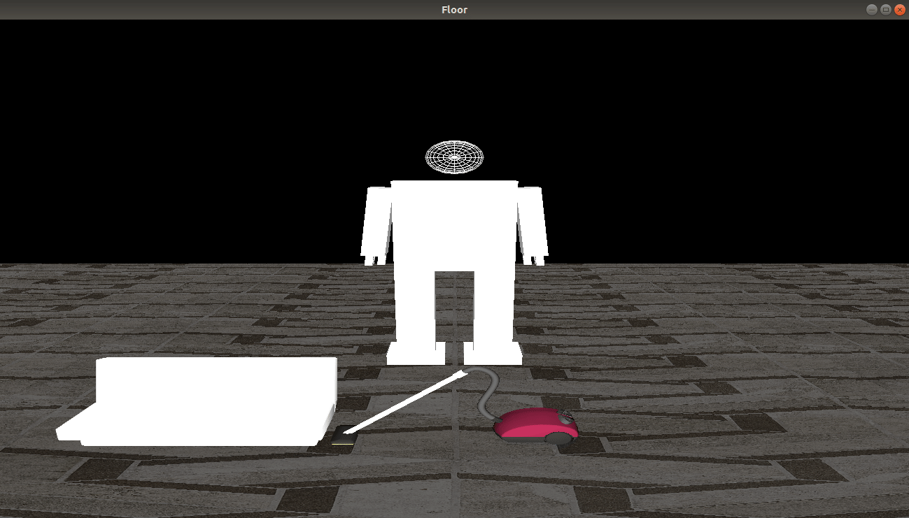

  

<li style="font-size:18px">GIF of animation of the robot it self</li>

   
 
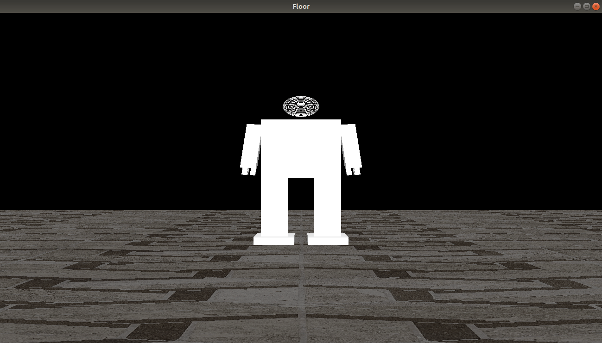

  

<li style="font-size:18px">GIF of animation of the robot with an object</li>

   
 
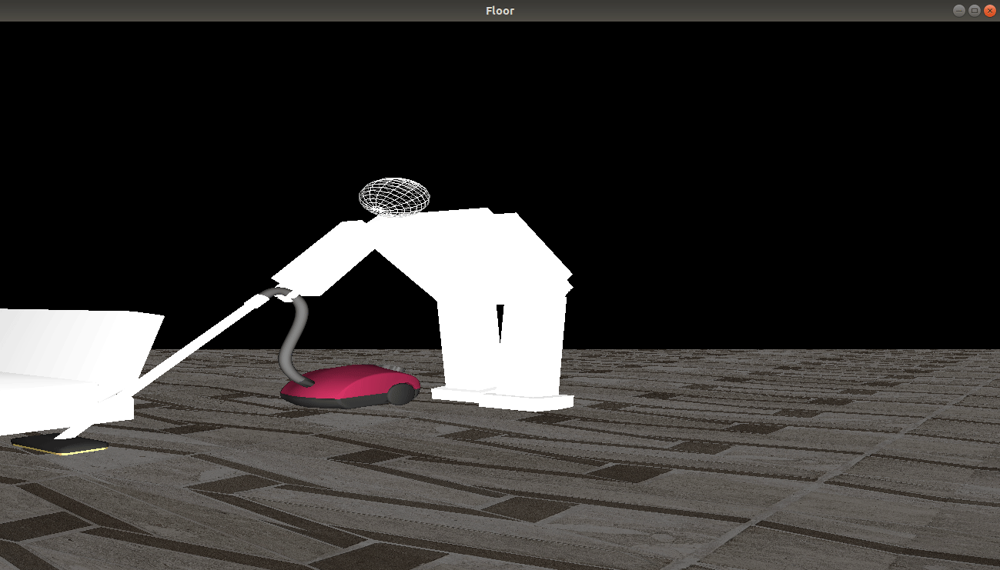

  

</ol>

# <li style="font-size:26px; color:SteelBlue"> Problems </li>

<ol style="font-size:18px">

| Problem                                                                   | Solution                             |
|-------------------------------------------------------------------------|--------------------------------------|
| We have some problems at first due to the `imageloader.cpp` and `glm.cpp` files           | It was fixed after we use the updated files   |

</ol>

# <li style="font-size:26px; color:SteelBlue"> Acknowledgements </li>

<ol  style="font-size:18px">

- `glm.cpp` and `imageloader.cpp` were provided to us in Tutorial 5 and we did not write them ourselves.
 

- We also use the texture, menu bar and lightning code from Tutorial 5 with some modification to match our code
</ol>
 

# Part2

### 1- Dynamically loading DICOM series 

- This is done by creating vtk.vtkDICOMImageReader object that reads the data of the choosen directory
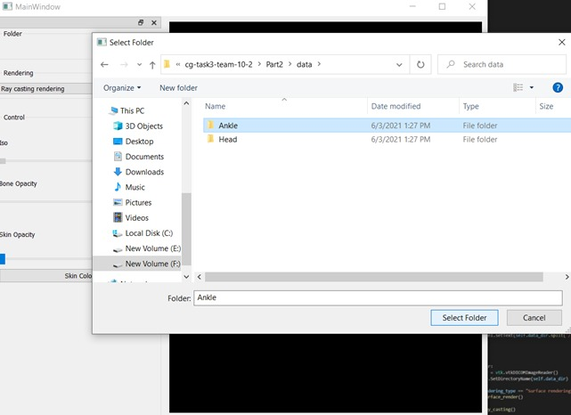 
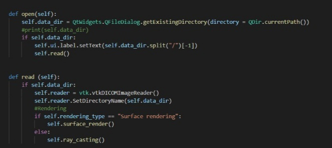  

### 2- Surface rendering with adjustable iso value 
- Adjustible iso value is supported using the Iso slider
- surface Normals are created by vtkPolyDataNormals filter for smooth shading
- vtkPolyDataMapper() object maps polygonal data to graphics primitives
- The camera is initialized and actor is added to the renderer

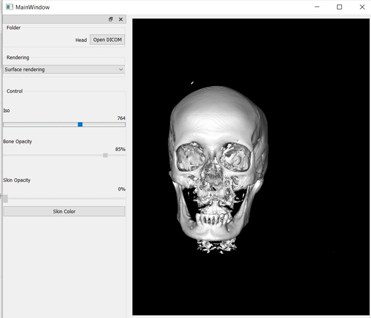
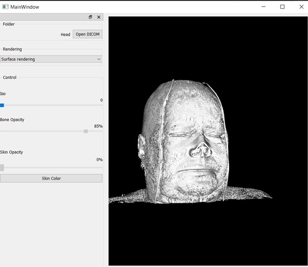

### 3- Ray casting rendering with adjustable transfer function
- vtk.vtkGPUVolumeRayCastMapper volume mapper object is created
- Color , opacity transfer functions map voxel intensities to colors and set opacity for different tissues 
- The opacity transfer function dynamically uses values for skin opacity and bone opacity from sliders 
- The color Transfer function uses value of skin color from QColorDialog that is connected to Skin color button 
- vtk.vtkVolumeProperty object attaches the color and opacity functions to the volume
- Linear interpolation is set for high quality rendering
- Flesh is adjusted between  (5 and 1000) in order to fully view skin and flesh 
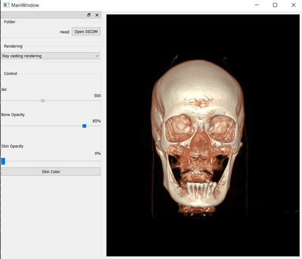
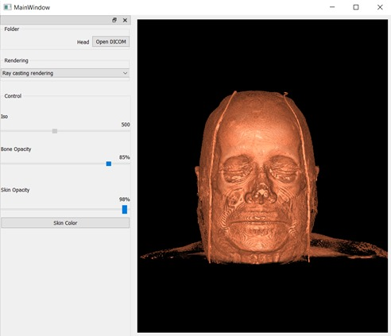
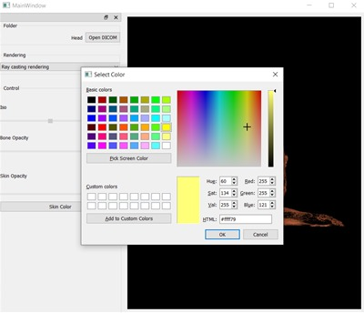
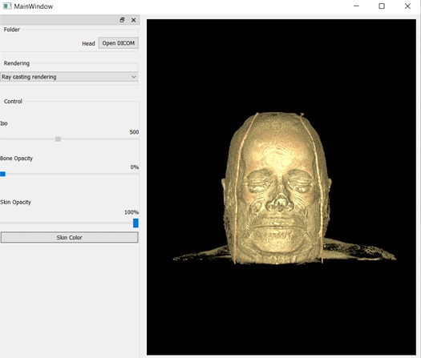

- Ankle outputs 
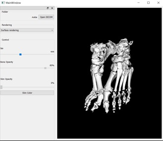
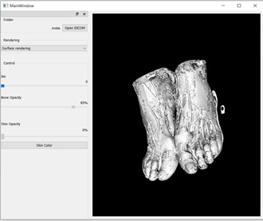
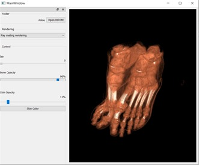
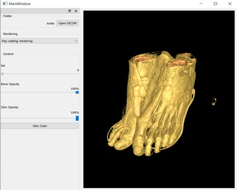

## Issues
- Part2: didm't know at first how to integrate vtk render window in pyqt widget and tried to promote qtwidget by different ways , and it worked by making the vtkWidget class and using QVTKRenderWindowInteractor , with the help of: http://vtk.1045678.n5.nabble.com/VTK-and-PyQt-td5735096.html

- Part2: Switching between rendering types of an opened Data, it worked well by resetting renderer by adding  
self.ren.RemoveAllViewProps() at the begining of rendering functions
  

